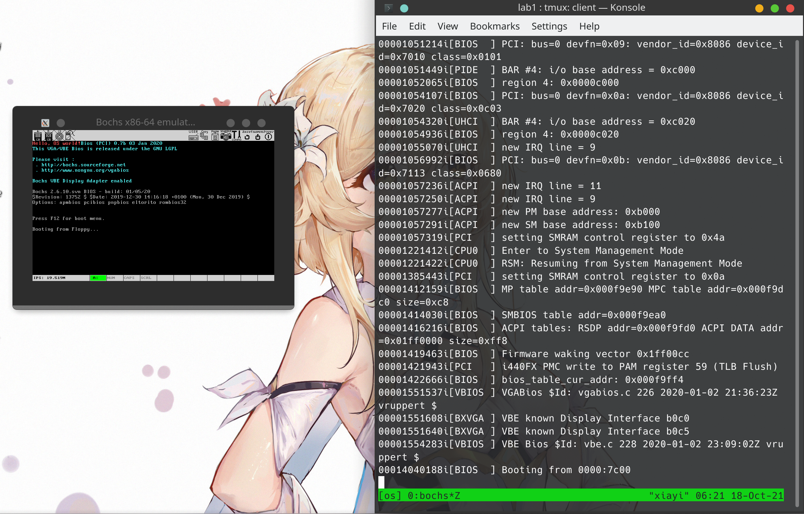
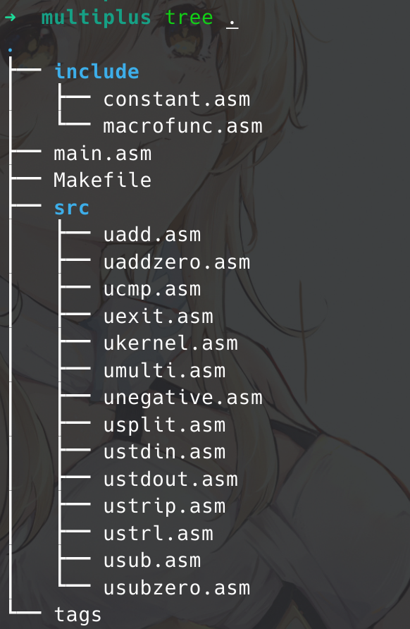
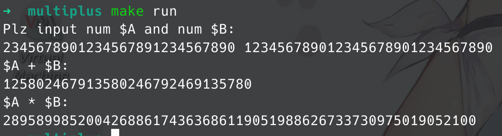

# 计算机操作系统实验一报告

191250045 侯为栋

- [计算机操作系统实验一报告](#计算机操作系统实验一报告)
  - [Hello OS](#hello-os)
  - [汇编语言实践](#汇编语言实践)
  - [问答题](#问答题)

> 注: 在负数加减处有 bug, 但是懒得调了

## Hello OS

boot.asm

```asm
; 程序加载到 0x7c00：增加段内偏移量
org 07c00h
 mov ax, cs
 mov ds, ax
 mov es, ax
 call DispStr
 jmp $

DispStr:
 mov ax, BootMessage
 mov bp, ax
 mov cx, 16
 mov ax, 01301h
 mov bx, 000ch
 mov dl, 0
 int 10h
 ret

BootMessage: db "Hello, OS world!"
; 512 byte, end with 0xaa55
times 510-($-$$) db 0
dw 0xaa55
```

bochsrc

```shell
# set virtual machine memory: 32MB
# This option sets the 'guest' and 'host' memory parameters to the same value. In all other cases the 'memory' option should be used instead
megs: 32
# The display library is the code that displays the Bochs VGA screen.
# use SDL 1.2.x library, cross platform
display_library: sdl
# floppy media type = 1_44, image name = a.img, the initial status of the media = inserted
floppya: 1_44=a.img, status=inserted
# This defines the boot sequence, the way virt starts
boot: floppy
```

运行截图：



## 汇编语言实践

项目结构：



默认实现 -10^32 - 10^32 以内的加法运算和乘法运算。

可以通过修改 include/constant.asm 中 `NUM_SIZE` 来调整计算范围。

运行方式：

```shell
make run
```

调试方式：

```shell
make gdb
```

其余选项请查阅 Makefile.

运行截图：



## 问答题

**请简述 80x86 系列的发展历史。**

- 8086：16 位处理器，数据总线 16 位，地址总线 20 位，能寻址 1MB
- 80286：16 位处理器，数据总线 16 位，地址总线 24 位，能寻址 16MB
- 80386：IA-32 架构，32 位处理器，数据总线和地址总线都是 32 位，能寻址 4GB ，兼容 16 位处理器，增加了保护模式、优先级、任务切换和片内的存储单元管理等硬件单元，采用了外置高速缓存
- 80486：集成了浮点处理器和 8KB 的一级缓存，使用了流水线技术、倍频技术
- 80586：奔腾，采用了超标量体系机构

**说明小端和大端的区别，并说明 80x86 系列采用了哪种方式？**

- 小端：最低有效字节在低地址；
- 大端：最低有效字节在高地址。

80x86 采用小端。

**8086 有哪五类寄存器，请分别举例说明其作用？**

8086 CPU 中寄存器总共为 14 个，且均为 16 位。

即 AX，BX，CX，DX，SP，BP，SI，DI，IP，FLAG，CS，DS，SS，ES 共 14 个。

而这 14 个寄存器按照一定方式又分为了通用寄存器，控制寄存器和段寄存器。

通用寄存器：

AX，BX，CX，DX 称作为数据寄存器：

AX (Accumulator)：累加寄存器，也称之为累加器；

BX (Base)：基地址寄存器；

CX (Count)：计数器寄存器；

DX (Data)：数据寄存器；

SP 和 BP 又称作为指针寄存器：

SP (Stack Pointer)：堆栈指针寄存器；

BP (Base Pointer)：基指针寄存器；

SI 和 DI 又称作为变址寄存器：

SI (Source Index)：源变址寄存器；

DI (Destination Index)：目的变址寄存器；

控制寄存器：

IP (Instruction Pointer)：指令指针寄存器；

FLAG：标志寄存器；

段寄存器：

CS (Code Segment)：代码段寄存器；

DS (Data Segment)：数据段寄存器；

SS (Stack Segment)：堆栈段寄存器；

ES (Extra Segment)：附加段寄存器；

**什么是寻址？立即寻址和直接寻址的区别是什么？**

寻址就是得到操作数地址从而获取操作数。

立即寻址在指令中直接给出操作数。

直接寻址是在指令格式的地址的字段中直接指出操作数在内存的地址。 操作数的地址直接给出而不需要经过某种变换。

**请举例说明寄存器间接寻址、寄存器相对寻址、基址加变址寻址、相对基址加变址寻址四种方式的区别。**

寄存器间接寻址：操作数有效地址在寄存器中

mov byte[eax], 1

寄存器相对寻址：偏移地址值通过 寄存器 + 偏移量值 的形式运算后获得

mov eax, ebx
add eax, 1
mov byte[eax], 1

基址加变址寻址：基址寄存器值加上变址寄存器值得到有效地址：

mov eax, esi
mov eax, ebx
mov byte[eax], 1

相对基址加变址：偏移地址值通过 基址寄存器 + 变址寄存器 + 偏移量值 的形式运算后获得：

mov eax, esi
mov eax, ebx
add eax, 1
mov byte[eax], 1

**请分别简述 MOV 指令和 LEA 指令的用法和作用？**

mov 对于变量来说加不加中括号都一样都是取值，对于寄存器来说加中括号是取地址中的值，不加中括号是取值

lea 对于变量来说加不加中括号都一样都是取地址，对于寄存器来说加中括号是取值，不加中括号非法

**请说出主程序与子程序之间至少三种参数传递方式。**

利用寄存器传参、利用约定地址传参、利用堆栈传参。

**如何处理输入和输出，代码中哪里体现出来？**

使用系统调用号 3 和 4 进行输出和输入。

具体说来就是读入一行再处理，得到有效信息。

**有哪些段寄存器？**

8086 有四个段寄存器：

- CS: Code segment

- DS: Data segment

- SS:Stack segment

- ES: Extra Segment

**通过什么寄存器保存前一次的运算结果，在代码中哪里体现出来。**

保存前一次运算结果？加减不用考虑，乘除法主要使用 ax，al，ah 这三者。

ax 保存乘法结果和被除数，al 为除法结果，ah 为取模结果。

**解释 boot.asm 文件中，org 07c00h 的作用。**

段内偏移量。引导程序在 0x7c00，所以段内所有偏移量需要考虑 0x7c00。

**boot.bin 应该放在软盘的哪一个扇区？为什么？**

第一个。BIOS 程序检查软盘的 0 面 0 磁道 1 扇区。

如果扇区以 0xaa55 结束则认定为引导扇区

**loader 的作用有哪些？**

跳入保护模式：

最开始的 x86 处理器 16 位，寄存器用 ax，bx 等表示，称为实模式。后来扩充成 32 位，eax，ebx 等，为了向前兼容，提出了保护模式。

必须从实模式跳转到保护模式，才能访问 1M 以上的内存。

启动内存分⻚；

从 kernel.bin 中读取内核，并放入内存，然后跳转到内核所在的开始地址，运行内核：

跟 boot 类似，使用汇编直接在软盘下搜索 kernel.bin；

不能把整个 kernel.bin 放在内存，而是要以 ELF 文件的格式读取并提取代码。

**解释 NASM 语言中 [ ] 的作用。**

获取地址所指向空间内容。

**解释语句 `times 510-($-$$) db 0` ，为什么是 510？ $ 和 $$ 分别表示什么？**

510 + 2 = 512。times 重复定义，$ 表示当前行的偏移地址，$$ 表示当前段的起始偏移地址。

最开始段基址为 0。

相当于最多填充 510 个字节，加上结尾两个约定的结束符正好 512 个字节。

这段代码被认为是 bios 代码：

如果扇区以 0xaa55 结束，则认定为引导扇区，将其 512 字节的数据加载到内存的 07c00 处。

然后设置 PC，跳到内存 07c00 处开始执行代码。

**解释配置文件 bochsrc 文件中如下参数的含义。**

```shell
megs: 32
display_library: sdl
floppya: 1_44=a.img, status=inserted
boot: floppy
```

见 Hello OS 中 bochsrc 部分注释。
