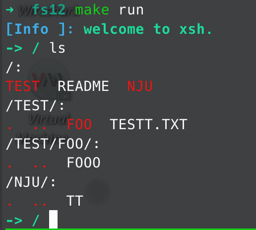
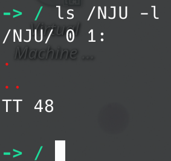

# OseLab2

191250045 侯为栋.

xsh: xiayi zsh.

## table of content

- [OseLab2](#oselab2)
  - [table of content](#table-of-content)
  - [usage](#usage)
  - [项目结构](#项目结构)
  - [运行截图](#运行截图)

## usage

- ls: 递归列出文件, 可有选项 -l, -ll;
- cat: 打印文件, 可以打印大于 512 字节文件;
- exit: 退出 xsh.

## 项目结构

```shell
.
├── build # 编译链接用文件夹
├── compile_commands.json 
├── img 
├── fat12
│   ├── a.img # 目标镜像, 在 Makefile 中指定路径
│   └── data # mount 文件夹
│       ├── NJU
│       │   └── TT
│       ├── README
│       └── TEST
│           ├── FOO
│           │   └── FOOO
│           └── TESTT.TXT
├── include
│   ├── common.h # 通用宏
│   ├── engine.h
│   ├── fs.h
│   └── nasm.h
├── main.c
├── Makefile
├── README.md
├── src
│   ├── engine # 命令行解析执行
│   │   ├── cat.c
│   │   ├── engine.c
│   │   ├── exit.c
│   │   ├── ls.c
│   │   └── Makefile
│   ├── fs.c # fat12 操作库
│   ├── Makefile
│   └── nasm # 输出库
│       ├── Makefile
│       ├── uprint.asm
│       └── uprint.c
├── tags
└── test
    ├── in
    └── out
```

去除空行是 698 行, 只计算 c 代码. 感谢 pa.

具体实现请 RTFSC. 如果想看的话.

## 运行截图

`ls`:



`ls /NJU -l`:



`cat`:


