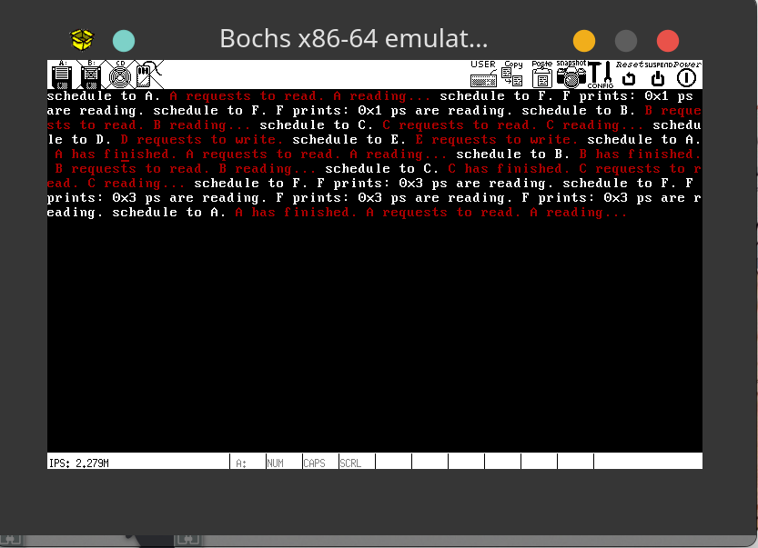
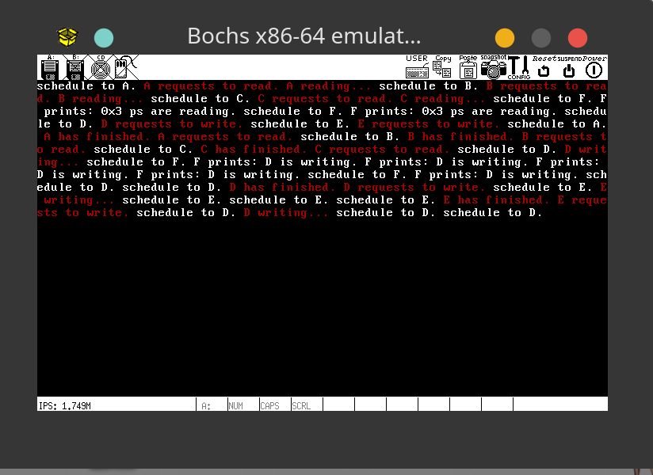

# OSLab4 实验报告

191250045 侯为栋.

## 运行方式

需要通过环境变量来设置读/写者优先.

### 读者优先

```shell
export RF=1
```

### 读写公平

```shell
export FAIR=1
```

### 写者优先

默认写者优先, 不设置环境变量即可.

设置完毕后运行:

```shell
make run
```

## 运行截图

读写公平未截图, 需要自行运行即可.

### 读者优先



### 写者优先



